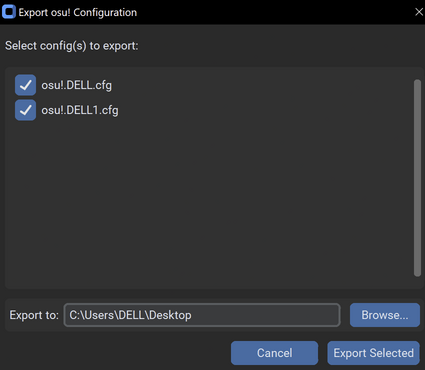

# osu! Launch Tool

  

[](https://opensource.org/licenses/MIT)


A GUI utility designed to simplify switching between Wacom default drivers and OpenTabletDriver for osu!, with integrated screen resolution control and configuration utilities.

**For users: Download [here!](https://github.com/ad1107/osu-launch-tool/releases/latest) and click on the first zip file**


*Note: Logo generated by Google Gemini 2.0.
  

## Purpose

Playing osu! with a drawing tablet often benefits from low-latency drivers like OpenTabletDriver. 
- However, for general desktop use or drawing applications, the Wacom driver are usually preferred. 
- Switching between these involves manually clicking scripts and troubleshooting – a tedious and error-prone task.

This provides ways automate driver switching, manage display resolution, and handle common tasks with easy actions.


- Windows **only** (10 is recommended) - requires Admin privilege.
  

## Features

  
*  **One-Click Driver & Game Actions:**

	*  **Run osu! with OTD:** Disables Wacom drivers, launches OpenTabletDriver, and starts osu!. Or simply  **Run osu! Only** 

	*  **Disable Wacom & Run OTD** and  **Disable OTD & Enable Wacom:** Easy driver switching.

	*  **Display Resolution Control:** Downscaling or Reverting to normal resolution.

*  **Utility Functions:**

	*  **Export Safe osu! Config:**

		

		* Scans your osu! folder for user-specific config files (`osu!.<username>.cfg`).

		* Presents a dialog to select which configs to export.

		* Allows choosing an export destination folder (defaults to Desktop).

		*  **Removes the token `Password = ...` line** from the selected file(s).

  

## Installation & Usage 
- For **end users**: Please check out the [Releases](https://github.com/ad1107/osu-launch-tool/releases) tab for easy access to built, ready-to-use portable executables.


- For **Develop / Contribute:**

1.  **Clone the repository**

2.  **Create and activate a virtual environment (recommended):**

```bash
python -m venv .venv
.\.venv\Scripts\activate
```
3.  **Install dependencies:**

```bash
pip install -r requirements.txt
```
4.  **Run the application:**

```bash
python main.py
```  

## Configuration


The application stores its settings in a file named `config.ini` located in:

`C:\Users\<YourUsername>\AppData\Roaming\osu! Launch Tool\`
  

## License


This project is licensed under the MIT License - see the [LICENSE](LICENSE) file for details.
